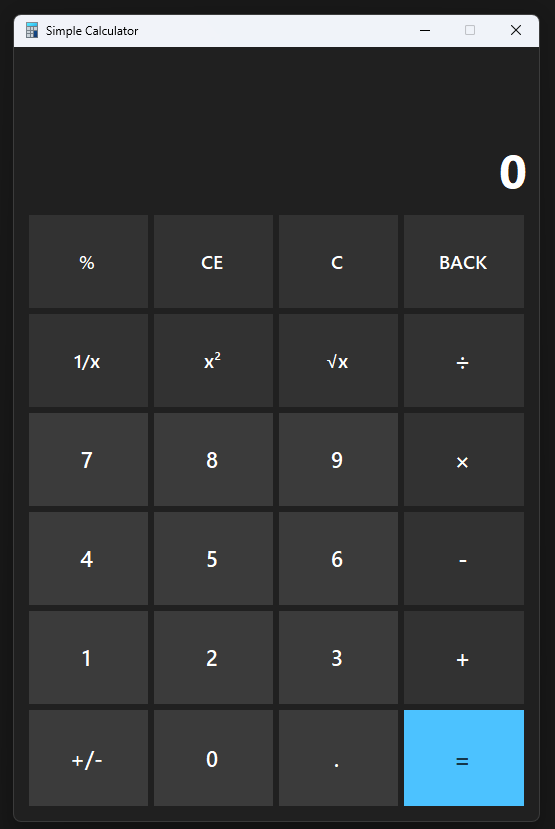

# Simple-Windows-Calculator
Simple Windows calculator project for C# beginners.
## User Interface

## Features
- This app provides functionality like Windows Calculator in Standard mode.
- Supports up to 15-digit numbers at once.
- You can add, substract, multiply, divide any count of numbers.
- You can perfom some additional operations such as square root, get square or inverse number as well.
- Evaluates commands immediately as they are entered.
- Keyboard controls are available.

